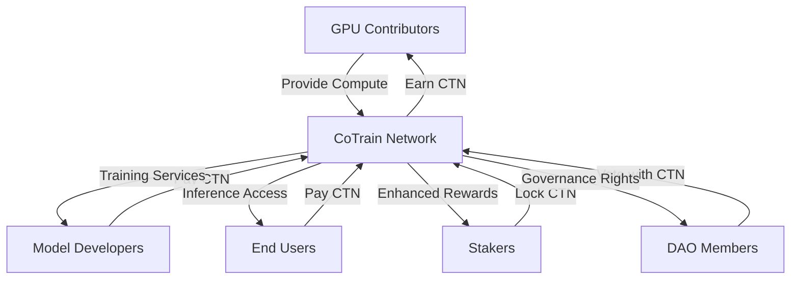

# 🔗 Fueling Collaborative AI with Aptos: The CTN Token Economy

CoTrain is more than a decentralized AI compute network — it's a global coordination engine powered by token incentives. And thanks to **Aptos**, it's faster, safer, and truly scalable.

---

## 🌐 Why Aptos?

By building on **Aptos**, the CTN token benefits from:

- ⚡ **Blazing-fast execution**: 100K+ TPS with parallel transaction processing
- 🧱 **Modular Move smart contracts**: Upgradeable logic for compute pricing, staking, rewards
- 🛡️ **Built-in safety**: Formal verification + gas metering ensure stable operations
- 🔄 **Composable token standards**: Native support for `FungibleAsset (FA)` with minimal overhead
- 💻 **Developer-ready**: Rust SDKs, client tools, and Move CLI for open integration
- 🌍 **Global accessibility**: Low transaction fees and fast finality worldwide

---

## 🪙 What is CTN?

The **CoTrain Network Token (CTN)** is a `FungibleAsset` issued on Aptos. It serves as the fuel for the entire collaborative AI platform:

- 💰 **Incentivizes GPU contributors** — Earn tokens for providing compute power
- 🔧 **Enables training and inference services** — Pay for AI model development and usage
- 🗳️ **Powers DAO-based governance** — Vote on network parameters and upgrades
- 🔒 **Facilitates staking** — Lock tokens for enhanced rewards and governance rights
- 🏆 **Rewards ecosystem participation** — Bonus tokens for community contributions

### Token Specifications

| Property | Value |
|----------|-------|
| **Name** | CoTrain Network Token |
| **Symbol** | CTN |
| **Blockchain** | Aptos |
| **Standard** | FungibleAsset (FA) |
| **Total Supply** | 1,000,000,000 CTN |
| **Decimals** | 8 |
| **Contract Address** | `0x...` (TBD on mainnet) |

---

## 🔁 Token Flow Overview



---

## 💼 Key Economic Actors

### 🧑‍💻 GPU Contributors

**Role**: Provide computational resources to the network

**How they earn CTN**:
- **Base rewards**: Automatic CTN distribution based on compute contribution
- **Performance bonuses**: Extra tokens for high uptime and reliability
- **Staking multipliers**: Enhanced rewards for locking CTN tokens
- **Reputation rewards**: Bonus tokens for maintaining good standing

**Reward calculation**:
```
Hourly CTN = Base Rate × GPU Performance × Uptime × Reputation × Staking Multiplier
```

### 🧠 Model Developers

**Role**: Create and train AI models using the network

**How they spend CTN**:
- **Training jobs**: Pay per GPU-hour for distributed training
- **Data storage**: Store datasets and model checkpoints
- **Priority access**: Pay premium for faster job scheduling
- **Custom environments**: Use specialized training containers

**How they can earn CTN**:
- **Model sharing**: Earn royalties when others use their models
- **Bounty completion**: Receive rewards for training specific models
- **Community contributions**: Get tokens for open-source contributions

### 👥 End Users / Consumers

**Role**: Access AI models and services

**How they spend CTN**:
- **Inference requests**: Pay per API call or batch request
- **Model subscriptions**: Monthly access to premium models
- **Custom fine-tuning**: Personalize models for specific use cases
- **Priority support**: Faster response times and dedicated resources

### 🏛️ DAO Members

**Role**: Govern the network and make strategic decisions

**How they participate**:
- **Proposal creation**: Submit governance proposals (requires CTN stake)
- **Voting**: Use CTN tokens to vote on network changes
- **Delegation**: Delegate voting power to trusted community members
- **Committee participation**: Join specialized governance committees

---

## 🔐 On-Chain Logic Powered by Move

Aptos' Move smart contracts enable sophisticated tokenomics:

### 🎚️ Dynamic Pricing
- **Supply/demand algorithms**: Automatic price adjustments based on network utilization
- **Regional pricing**: Different rates for different geographic regions
- **Time-based pricing**: Lower rates during off-peak hours
- **Quality tiers**: Premium pricing for high-performance GPUs

### 🧾 Transparent Rewards
- **Proof-of-contribution**: Cryptographic verification of work completed
- **Real-time distribution**: Instant reward payments upon task completion
- **Audit trails**: Complete history of all reward distributions
- **Dispute resolution**: On-chain arbitration for reward disputes

### 🏦 Token Management
- **Multi-signature vaults**: Secure custody of treasury funds
- **Streaming payments**: Continuous reward distribution over time
- **Escrow services**: Secure payment holding for long-running jobs
- **Emergency controls**: Circuit breakers for unusual market conditions

### 🗳️ DAO Governance
- **Proposal lifecycle**: Structured process from submission to execution
- **Voting mechanisms**: Various voting types (simple majority, quadratic, etc.)
- **Execution automation**: Automatic implementation of approved proposals
- **Veto powers**: Emergency stops for critical network protection

---

## 📊 Token Distribution & Allocation

### Initial Distribution (1B CTN Total)

| Allocation | Percentage | Amount | Vesting | Purpose |
|------------|------------|--------|---------|----------|
| **Community Rewards** | 40% | 400M CTN | 4 years | GPU contributor incentives |
| **Ecosystem Development** | 20% | 200M CTN | 3 years | Grants, partnerships, integrations |
| **Team & Advisors** | 15% | 150M CTN | 4 years | Core team and strategic advisors |
| **Treasury/DAO** | 10% | 100M CTN | Unlocked | Community-governed funds |
| **Private Sale** | 8% | 80M CTN | 2 years | Early investors and strategic partners |
| **Public Sale** | 5% | 50M CTN | 6 months | Public token distribution |
| **Liquidity & Market Making** | 2% | 20M CTN | Unlocked | Exchange liquidity and stability |

### Emission Schedule

**Years 1-2**: 50% of community rewards (200M CTN)
**Years 3-4**: 30% of community rewards (120M CTN)
**Years 5+**: 20% of community rewards (80M CTN)

*Note: Emission rates can be adjusted through DAO governance*

---

## 📈 Token Use Cases & Utility

### Primary Utilities

| Use Case | Description | CTN Required |
|----------|-------------|-------------|
| **GPU Contribution** | Earn tokens for providing compute | 0 CTN (earn tokens) |
| **Training Jobs** | Pay for distributed model training | Variable (based on resources) |
| **Inference Services** | Access AI models via API | 0.001-1 CTN per request |
| **Staking** | Lock tokens for enhanced rewards | Minimum 100 CTN |
| **Governance Voting** | Participate in DAO decisions | Minimum 10 CTN |
| **Priority Access** | Jump the queue for urgent jobs | 2x standard rate |

### Advanced Features

- **Reputation Staking**: Lock CTN to build trust and earn multipliers
- **Insurance Pools**: Contribute to pools that protect against node failures
- **Bounty Programs**: Fund specific research or model development
- **Cross-chain Bridges**: Use CTN on other blockchains (future)
- **NFT Integration**: Special tokens for unique contributions or achievements

---

## 🔄 Economic Mechanisms

### Deflationary Pressure

- **Transaction Fees**: Small portion of all transactions burned
- **Premium Services**: 10% of premium payments burned
- **Governance Proposals**: Proposal fees burned if rejected
- **Slashing Events**: Tokens from malicious actors burned

### Inflationary Pressure

- **Contributor Rewards**: New tokens minted for GPU providers
- **Ecosystem Grants**: Tokens allocated for development
- **Staking Rewards**: Additional yield for token lockers
- **Bug Bounties**: Rewards for security researchers

### Balance Mechanisms

- **Adaptive Emission**: Reward rates adjust based on network needs
- **Burn Rate Monitoring**: Automatic adjustments to maintain token value
- **Treasury Management**: DAO-controlled buying/selling for stability
- **Market Making**: Algorithmic trading to reduce volatility

---

## 📊 Governance Example Proposals

### 🗳️ Proposal #001: Adjust Base Reward Rate

**Summary**: Increase hourly CTN rewards for GPU contributors by 15% to attract more nodes

**Details**:
- Current rate: 0.5 CTN/GPU-hour
- Proposed rate: 0.575 CTN/GPU-hour
- Expected impact: +25% network capacity
- Budget impact: +50K CTN/month

**Voting Options**:
- ✅ Approve (65% - 650K CTN)
- ❌ Reject (35% - 350K CTN)

**Status**: ✅ **APPROVED** - Implementation in progress

---

### 🗳️ Proposal #002: New Model Training Bounty

**Summary**: Allocate 100K CTN bounty for training an open-source medical AI model

**Details**:
- Target: 70B parameter medical diagnosis model
- Dataset: Curated medical imaging data
- Timeline: 3 months
- Requirements: Open-source release under MIT license

**Voting Options**:
- ✅ Approve with full budget (45% - 450K CTN)
- 🔄 Approve with reduced budget (30% - 300K CTN)
- ❌ Reject (25% - 250K CTN)

**Status**: 🔄 **UNDER REVIEW** - Voting ends in 5 days

---

## 🛡️ Security & Risk Management

### Smart Contract Security

- **Formal Verification**: All contracts verified using Move's formal verification tools
- **Multi-signature Controls**: Critical functions require multiple signatures
- **Upgrade Mechanisms**: Controlled upgrade paths with community approval
- **Emergency Pauses**: Circuit breakers for critical vulnerabilities

### Economic Security

- **Slashing Conditions**: Penalties for malicious behavior
- **Insurance Funds**: Community pools to cover losses
- **Audit Requirements**: Regular economic model reviews
- **Stress Testing**: Simulation of extreme market conditions

### Operational Security

- **Key Management**: Secure storage of treasury and operational keys
- **Access Controls**: Role-based permissions for different functions
- **Monitoring Systems**: Real-time alerts for unusual activity
- **Incident Response**: Predefined procedures for security events

---

## 🎯 Future Enhancements

### Short Term (6-12 months)

- **Mobile Staking App**: Stake and monitor rewards on mobile devices
- **Cross-chain Bridges**: Use CTN on Ethereum and other chains
- **Advanced Analytics**: Detailed dashboards for token holders
- **Automated Strategies**: Smart contracts for optimal staking

### Medium Term (1-2 years)

- **Prediction Markets**: Bet on AI model performance with CTN
- **Fractional Ownership**: Share ownership of expensive GPU clusters
- **Insurance Products**: Protect against various network risks
- **Yield Farming**: Additional earning opportunities for token holders

### Long Term (2+ years)

- **AI-Powered Economics**: Machine learning for optimal tokenomics
- **Quantum-Resistant Security**: Prepare for quantum computing threats
- **Interplanetary Network**: Extend to space-based computing resources
- **Universal Basic Compute**: Free AI access funded by token economics

---

## ❓ Tokenomics FAQ

<details>
<summary><strong>How are CTN rewards calculated?</strong></summary>
<div>
Rewards are calculated based on multiple factors: GPU performance, uptime, network demand, staking multipliers, and reputation score. The base formula is: <code>Hourly CTN = Base Rate × GPU Performance × Uptime × Reputation × Staking Multiplier</code>
</div>
</details>

<details>
<summary><strong>Can I lose my staked CTN tokens?</strong></summary>
<div>
Staked tokens can be slashed (partially lost) only if you engage in malicious behavior like submitting false computations or attempting to attack the network. Normal operation and honest mistakes do not result in slashing.
</div>
</details>

<details>
<summary><strong>How does governance voting work?</strong></summary>
<div>
Token holders can vote on proposals using their CTN tokens. Voting power is proportional to tokens held, but there are mechanisms to prevent whale dominance, including quadratic voting for certain proposal types and delegation systems.
</div>
</details>

<details>
<summary><strong>What happens if I want to sell my CTN tokens?</strong></summary>
<div>
CTN tokens are freely tradeable on supported exchanges. However, staked tokens have unlock periods, and some governance positions may require minimum holding periods. Check the specific terms for your situation.
</div>
</details>

<details>
<summary><strong>How does CoTrain prevent token price manipulation?</strong></summary>
<div>
We use multiple mechanisms: algorithmic market making, treasury-managed stability funds, transparent on-chain governance, and economic incentives that align long-term value creation with token price appreciation.
</div>
</details>

---

## 🧠 Economic Philosophy

> *"True decentralization requires not just distributed infrastructure, but distributed ownership and governance. The CTN token ensures that those who contribute to the network's success share in its rewards, and those who use the network have a voice in its future."*

CoTrain's tokenomics are designed around core principles:

- **🤝 Fairness**: Rewards proportional to contribution
- **🌍 Accessibility**: Low barriers to participation
- **🔄 Sustainability**: Long-term economic viability
- **🗳️ Democracy**: Community-driven decision making
- **🔒 Security**: Robust protection against attacks
- **📈 Growth**: Incentives for network expansion

---

## 🚀 Get Started with CTN

Ready to participate in the CoTrain economy?

### For Contributors
1. **[Set up a node](/docs/quickstart)** and start earning CTN
2. **[Stake your tokens](https://stake.cotrain.ai)** for enhanced rewards
3. **[Join governance](https://gov.cotrain.ai)** and help shape the future

### For Developers
1. **[Explore the SDK](/docs/sdk)** and build with CTN integration
2. **[Submit training jobs](https://app.cotrain.ai)** using CTN tokens
3. **[Create models](https://models.cotrain.ai)** and earn royalties

### For Investors
1. **[Buy CTN tokens](https://trade.cotrain.ai)** on supported exchanges
2. **[Participate in governance](https://gov.cotrain.ai)** and vote on proposals
3. **[Monitor the economy](https://analytics.cotrain.ai)** with real-time dashboards

---

<div className="grid grid-cols-1 md:grid-cols-2 gap-4 mt-8">
  <div className="p-6 border rounded-lg">
    <h3 className="text-lg font-semibold mb-2">💰 Start Earning</h3>
    <p className="text-sm text-muted-foreground mb-4">Set up your GPU node and earn CTN tokens</p>
    <a href="/docs/quickstart" className="text-blue-600 hover:text-blue-800 font-medium">Start Contributing →</a>
  </div>
  <div className="p-6 border rounded-lg">
    <h3 className="text-lg font-semibold mb-2">🗳️ Join Governance</h3>
    <p className="text-sm text-muted-foreground mb-4">Participate in DAO decisions and proposals</p>
    <a href="https://gov.cotrain.ai" className="text-blue-600 hover:text-blue-800 font-medium">Vote Now →</a>
  </div>
</div>

[Learn about Development →](/docs/development) • [Explore the SDK →](/docs/sdk) • [View API Reference →](/docs/api)