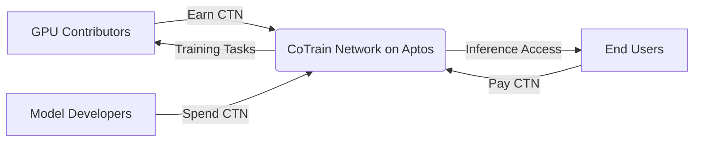

# 🔗 Fueling Collaborative AI with Aptos: The CTN Token Economy

CoTrain is more than a decentralized AI compute network — it's a global coordination engine powered by token incentives. And thanks to **Aptos**, it's faster, safer, and truly scalable.

---

## 🌐 Why Aptos?

By building on **Aptos**, the CTN token benefits from:

- ⚡ **Blazing-fast execution**: 100K+ TPS with parallel transaction processing.
- 🧱 **Modular Move smart contracts**: Upgradeable logic for compute pricing, staking, rewards.
- 🛡️ **Built-in safety**: Formal verification + gas metering ensure stable operations.
- 🔄 **Composable token standards**: Native support for `FungibleAsset (FA)` with minimal overhead.
- 💻 **Developer-ready**: Rust SDKs, client tools, and Move CLI for open integration.

---

## 🪙 What is CTN?

The **CoTrain Network Token (CTN)** is a `FungibleAsset` issued on Aptos. It serves as the fuel for the entire collaborative AI platform:

- 💰 Incentivizes GPU contributors
- 🔧 Enables training and inference services
- 🗳️ Powers DAO-based governance

---

## 🔁 Token Flow Overview



---

## 💼 Key Economic Actors

### 🧑‍💻 GPU Contributors

- Run CoTrain node and provide compute
- Automatically rewarded with CTN (via on-chain metering)
- Rewards adjusted by uptime, GPU type, reputation

### 🧠 Model Developers

- Launch training using CTN as fuel
- Define job specs, datasets, environments
- Optionally offer bonus rewards to node operators

### 👥 End Users / Consumers

- Use AI models via API or CoTrain UI
- Pay CTN per inference, batch request, or rental
- Interact with open or private models

---

## 🔐 On-Chain Logic Powered by Move

Aptos' Move contracts power:

- 🎚️ **Dynamic pricing**: Chain-based rate adjustment modules
- 🧾 **Transparent rewards**: Proof-of-contribution via task receipts
- 🏦 **Token vaults**: Custody, streaming payments, stake locking
- 🗳️ **DAO governance**: On-chain voting, parameter change proposals

---

## 📊 Token Use Cases

| Use Case                  | Actor             | CTN Action         |
|---------------------------|------------------|--------------------|
| Launch training job       | Developer         | CTN → Burned/Paid  |
| GPU contribution reward   | Node Operator     | CTN → Minted/Paid  |
| Use inference service     | Consumer          | CTN → Spent        |
| Stake for higher earnings | Node Operator     | CTN → Locked       |
| DAO voting / proposal     | Holder            | CTN → Staked/Used  |

---

## 📉 Governance Example Proposal

```markdown
### 🗳️ Proposal #002: Update CTN Emission Rate

**Summary:**  
Reduce hourly CTN rewards for idle GPUs by 20% to promote active job participation.

**Why:**  
Encourages contributors to run full jobs instead of staying online idle.

**Options:**
- ✅ Approve
- ❌ Reject
- 🕗 Abstain

Voting ends: 2025-08-01 00:00 UTC
```

👉 [Vote on Aptos DAO Portal](https://dao.cotrain.ai/proposals/002)

---

## ❓ On-chain FAQ

<details>
  <summary><strong>Is CTN compatible with Aptos wallets?</strong></summary>
  <div>
    Yes! CTN follows the `FungibleAsset` standard and works with Petra, Martian, Pontem, and more.
  </div>
</details>

<details>
  <summary><strong>Can I trade CTN?</strong></summary>
  <div>
    CTN will be available on Aptos DEXes such as Liquidswap and Econia, and can be swapped for stablecoins or staked in pools.
  </div>
</details>

<details>
  <summary><strong>What if I change my GPU?</strong></summary>
  <div>
    Your node's identity is wallet-bound. You can upgrade hardware anytime and keep earning under the same address.
  </div>
</details>

<details>
  <summary><strong>Is CTN inflationary?</strong></summary>
  <div>
    CTN follows an adaptive mint-burn policy governed by DAO. As usage grows, burn rate and staking increase to maintain balance.
  </div>
</details>

---

## 🧠 Final Words

By issuing CTN as a Move-based `FungibleAsset` on Aptos, CoTrain gains:

- ⚙️ Modular compute economics
- 🌎 Interoperability across Aptos dApps
- 💡 Upgradeable governance and smart logic
- 🔐 Trustless enforcement via blockchain

> CoTrain is not just an AI compute network — it’s a next-gen, blockchain-native AI economy. Powered by Aptos. Fueled by CTN.

